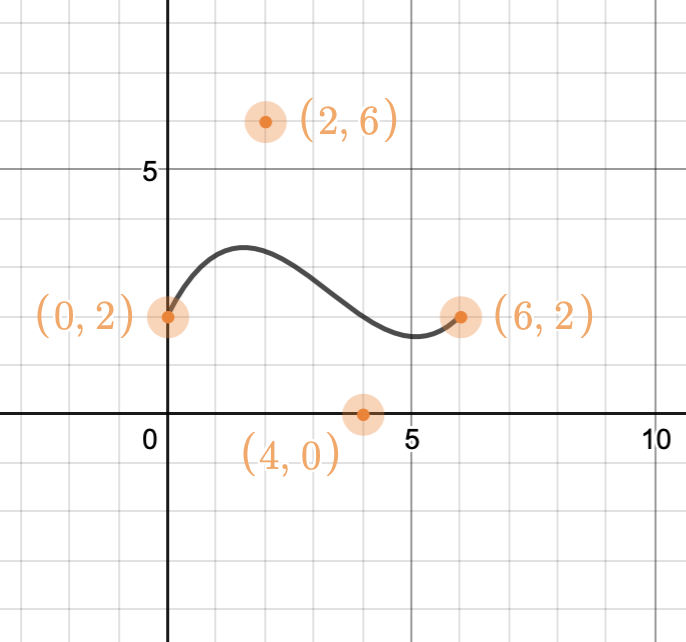
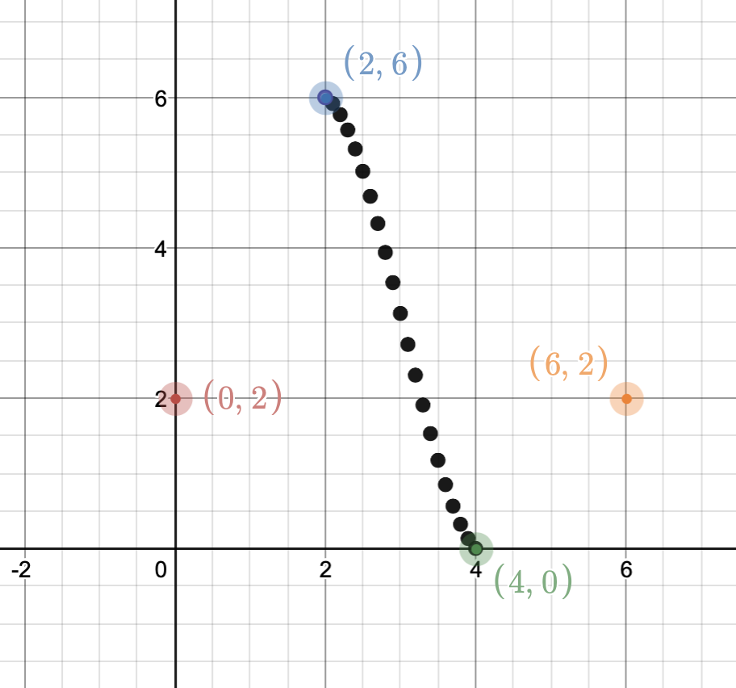
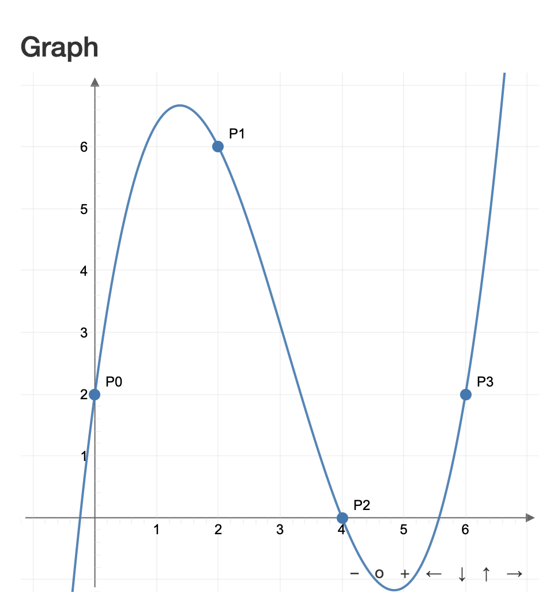
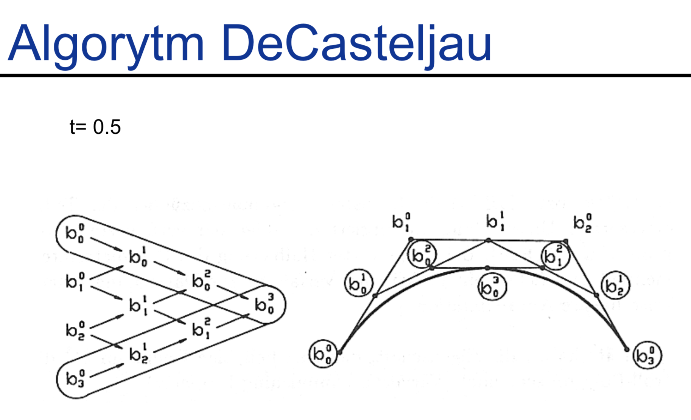
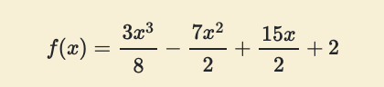

## Mamy dane punkty kontrolne: (0,2) (2,6) (4,0) (6,2)

a) Naszkicuj krzywą Beziera  
  
  
b) Naszkicuj krzywą Catmull-Rom'a  

  
c) Naszkicuj wielomian Lagrange'a, traktując koordynat x jako argument, a y jako wartość  

  
## Komentarz
### Krzywa Beziera  
Krzywą można narysować przy pomocy Algorytmu DeCasteljau  
Rysowanie krzywej przybliżonej:  
dla każego k z [0.01, 0.02, 0.03, ..., 0.99]:  
Między każdymi "sąsiadującymi (punkty są kolejno ponumerowane, p1, p2, itd)" 2 punktami wyznaczamy nowy punkt, biorąc jeden punkt z wagą k, a drugi z (1-k). Tak otrzymujemy nowe n-1 punktów. Na nich wykonujemy to samo aż zostanie nam 1 punkt. Tak otrzymane punkty dla wszystkich k łączymy.  
Dla k = 0.5:  
  

### Wielomian Lagrange'a  
  
Obliczanie wielomianu jest męczące.  
Sensowne tylko dla 3 punktów.  
Stopień wielomianu = ilość punktów - 1. 
Przechodzi przez wszystkie i tak łazi góra dół.  
W wykładzie 7 (Krzywe) na stronie 14 jest opisane jak go policzyć.  
